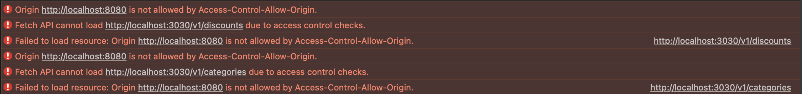

# Web API workshop

This workshop aims student of EPITA SIGL 2023.

In this workshop, you will learn how to:
- create a web API using [NodeJS](https://nodejs.org/en/) and [Express library](https://expressjs.com/)
- deploy a web API using Docker and your Scaleway instance
- consume a web API from client (in this case your reactive frontend from last workshop)

> Note: for this workshop, you will NOT use any databases.
> This will be the subject of another workshop.

## Step 0: Initiate your web API

From your group's repository (e.g.: socra-groupXX): 
- create a `backend` folder (same level as `frontend`)
```sh
# from your project's repository, where you can see your frontend/ folder
mkdir -p backend
```

- initiate a new nodejs project using node v16
```sh
cd backend
nvm use v16
npm init -y
```
- add express dependency
```sh
# still from backend/ folder
npm i --save express
```
- add a first 'Hello Socrate' route to `backend/src/server.js`
    - from your terminal:
        ```sh
        # From backend/; create a new src/ folder and server.js file
        mkdir -p src
        touch src/server.js
        ```
    - inside `backend/src/server.js`
        ```js
        const express = require("express");
        const app = express();
        const port = 3030;

        app.get("/", (req, res) => {
          res.send("Hello Socrate!");
        });

        app.listen(port, () => {
          console.log(`Listening at http://localhost:${port}`);
        });
        ```

Run the hello world code from your terminal:
```sh
# from backend/
nvm use v16
node src/server.js
```

Your web api should listen on [localhost:3030](http://localhost:3030/).
If you go from your browser, you should see `Hello Socrate!`.

Before adding your changes to git, create a new `backend/.gitignore` file with:
```plain
node_modules
```

This will avoid pushing dirty files.

## Step 1: Expose products, discounts and product categories

**Objective**: From your web API, expose:
- products
- categories of products
- products on discounts

### Expose product categories

**Objective**: When a client `GET` the route `v1/categories`; it recieves the list of product categories.

- Copy `frontend/src/data/categories_fr.json` to `backend/src/data/categories_fr.json`
- Your `backend/src/server.js` file should look like:
```js
const express = require("express");
const categories = require("./data/categories_fr.json");
const app = express();
const port = 3030;

app.get("/", (req, res) => {
  res.send("Hello Socrate!");
});

app.get("/v1/categories", (req, res) => {
    res.send(categories);
});

app.listen(port, () => {
  console.log(`Listening at http://localhost:${port}`);
});
```

- Restart your `node src/server.js` process
- Make sure your retreive product categories by querying: http://localhost:3030/v1/categories

> Note: to query a web API; you can use eiter: 
>   - your browser (for `GET` API calls)
>   - [cURL]((https://curl.se/)) CLI from your terminal for every kind of API calls

### Challenge: Expose products on discounts

**Objective**: When a client `GET` the route `v1/discounts`; it recieves the list of products in discount.

- Do the same as previous step but copy `frontend/data/discounts_fr.json`
- Restart your `node src/server.js` process
- Make sure your retreive discounted products by querying: http://localhost:3030/v1/discounts

### Challenge: Expose products of a given category

**Ojbective**: When a client `GET` the route `v1/products/<categoryId>`; it receives the list of all products of the given category.

- Use the same product data as `frontend/data/products_fr.json`
- See [how to get route parameter from request](https://expressjs.com/en/5x/api.html#req) and adapt those example to get the correct categoryId.
- Your handler will have a simple `filter` logic to return only products of a given category:
```javascript
// categoryId being the value recovered from request
// products being the products inside backend/src/data/products_fr.json
products.filter(product => product.categoryId === +categoryId) 
```
> IMPORTANT: the `+` in front of `categoryId` makes sure that the request parameter is `cast` to an integer.
> Otherwise you would not filter the products correctly (e.g. 1 !== "1")
- Restart your `node src/server.js` process
- Make sure your retreive product categories by querying: [http://localhost:3030/v1/products/<categoryId>](http://localhost:3030/v1/products/<categoryId>)

> Note: for example, http://localhost:3030/v1/products/1 would return only fruits

## Step 2: Deploy your web API

**Objective**: have your web API deployed at https://api.groupXX.socra-sigl.fr (groupXX replaced by your groupe number)

### Create a Dockerfile for your NodeJS web API

- Create a new `backend/Dockerfile` file with:
```dockerfile
FROM node:16

COPY . /code
WORKDIR /code

RUN npm i
CMD ["node", "src/server.js"]

EXPOSE 3030
```

Make sure the container runs locally using `--init` flag.

> Note: you need to run your docker image with `—init` flag because of [this known issue from docker + node together](https://github.com/nodejs/docker-node/blob/main/docs/BestPractices.md#handling-kernel-signals)
```sh
# from backend
docker build -t socrate-web-api:local .
docker run --init -p 3033:3030 socrate-web-api:local
```
Now make sure you can get product categories when querying [localhost:3033/v1/categories](http://localhost:3033/v1/categories)

### Create a new job in your github workflow

Now that you have a runnning docker setup for your node web API, add a new job to your current CD workflow.

From `.github/workflows/main.yml`, making sure to replace `socra-groupXX` by your group number 
and `<groupOrganization>` by your organization/user's name on github:
```yaml
# inside .github/workflows/main.yml
# ....
jobs:
  # Rename former `build` to `build-frontend` for clarity. Steps and all stay the same for frontend
  build-frontend:
    # ... 
  build-backend:
    runs-on: ubuntu-latest
    steps:
      - uses: actions/checkout@v2
      - name: build and publish backend docker image
        working-directory: backend
        run: |
          docker login ghcr.io -u ${{ secrets.DOCKER_USER }} -p ${{ secrets.DOCKER_PASSWORD }}
          docker build -t ghcr.io/<groupOrganization>/socra-groupXX/socrate-web-api:${{ github.sha }} .
          docker push ghcr.io/<groupOrganization>/socra-groupXX/socrate-web-api:${{ github.sha }} 
      - name: Deploy on production VM
        uses: appleboy/ssh-action@master
        with:
          host: ${{ secrets.SSH_HOST }}
          username: ${{ secrets.SSH_USER }}
          key: ${{ secrets.SSH_KEY }}
          script: |
            docker login ghcr.io -u ${{ secrets.DOCKER_USER }} -p ${{ secrets.DOCKER_PASSWORD }}
            docker pull ghcr.io/<groupOrganization>/socra-groupXX/socrate-web-api:${{ github.sha }}
            (docker stop socrate-web-api && docker rm socrate-web-api) || echo "Nothing to stop"
            docker run -d --network web --name socrate-web-api --init --label "traefik.http.routers.socrate-web-api.rule=Host(\`api.${{ secrets.SSH_HOST }}\`)" --label "traefik.http.services.socrate-web-api.loadbalancer.server.port=3030" --label "traefik.http.routers.socrate-web-api.tls=true" --label "traefik.http.routers.socrate-web-api.tls.certresolver=myresolver" --label "traefik.enable=true" --label "traefik.docker.network=web" ghcr.io/<groupOrganization>/socra-groupXX/socrate-web-api:${{ github.sha }}
```

It's very similar to your frontend build job, expect:
- `working-directory` is `backend`
- `image-name` and `container-name` are `socrate-web-api`
- `label` in traefik is `api.groupXX.socra-sigl.fr`
- `--init` flag should be there when running the docker container

Commit/push your changes, and you should trigger CD workflow.
After few minutes, you should be able to access your web API on https://api.groupXX.socra-sigl.fr 

## Step 3: Integrate web API to Socrate's frontend

**Objective**: Your frontend fetch data served by your new web API. 

> No more `frontend/src/data` folder!

### Frontend: Setup for different domain names (localhost vs api.groupXX.socra-sigl.fr)

**Problem**: Frontend need to query localhost:3030 when running on your local machine and api.groupXX.socra-sigl.fr when running on production.

To solve this issue, you will use [webpack.DefinePlugin](https://webpack.js.org/plugins/define-plugin/) to inject a global variable with correct API endpoint; depending on which bundle you want to build.

- replace `frontend/config/webpack.dev.js` with:
```js
const webpack = require("webpack");
const { merge } = require("webpack-merge");
const common = require("./webpack.common.js");

module.exports = merge(common, {
  mode: "development",
  devServer: {
    historyApiFallback: true,
  },
  plugins: [
    ...common.plugins,
    new webpack.DefinePlugin({
      SOCRATE_API_URL: JSON.stringify("http://localhost:3030"),
    }),
  ],
});
```
- and `frontend/config/webpack.pro.js` with:
```js
const webpack = require("webpack");
const { merge } = require("webpack-merge");
const common = require("./webpack.common.js");
module.exports = merge(common, {
  mode: "production",
  plugins: [
    ...common.plugins,
    new webpack.DefinePlugin({
      SOCRATE_API_URL: JSON.stringify("https://api.group30.socra-sigl.fr"),
    }),
  ],
});
```

The variable `SOCRATE_API_URL` is now available in your frontend code.

### Frontend: create function to call your web api

- Create a new file `frontend/src/utils.js` with:
```js
export async function callApi(route) {
  const endpoint = `${SOCRATE_API_URL}${route}`;
  const response = await fetch(endpoint);
  return await response.json();
}
```

This function is a bit special, it uses [`async` and `await`](https://developer.mozilla.org/en-US/docs/Web/JavaScript/Reference/Statements/async_function) keywords.

Because `async/await` is only added recently to JavaScript; you need to extend the [babel configuration with a new plugin](https://babeljs.io/docs/en/babel-plugin-transform-runtime) to make it work on all browsers.

- install the [new babel plugin](https://babeljs.io/docs/en/babel-plugin-transform-runtime):
```sh
# from frontend/
nvm use 16
npm install --save-dev @babel/plugin-transform-runtime
npm install --save @babel/runtime
```
- Adapt your `frontend/config/weback.common.js`'s babel-loader rule with:
```js
// ...
//   module: {
//    rules: [ ... ,
      {
        test: /\.js$/,
        exclude: /node_modules/,
        use: {
          loader: "babel-loader",
          options: {
            presets: [
              "@babel/preset-env",
              ["@babel/preset-react", { runtime: "automatic" }],
            ],
            plugins: [
              [
                "@babel/plugin-transform-runtime",
                {
                  regenerator: true,
                },
              ],
            ],
          },
        },
      },
// ...
```

### Frontend: use data from your web API

Now that you have your async function to call your API, let's use it!

- First, remove the `frontend/src/data` folder. We won't need it!
- Replace first lines of `frontend/src/SocrateContext.js` with:
  ```jsx
  import React from "react";

  export const initialState = {
    orders: [],
    basket: [],
  };

  // ...
  ```
  Rest of the file stays the same
- Replace `frontend/src/Discounts.js` with:
```jsx
import React from "react";
import ProductCard from "./ProductCard";
import { callApi } from "./utils";

function Discounts() {
  const [ discounts, setDiscounts ] = React.useState([]);

  React.useEffect(function() {
    async function fetchDiscounts() {
      try {
        const discountProducts = await callApi('/v1/discounts');
        setDiscounts(discountProducts)
      } catch {
        console.log("ERROR: can't fetch discounts")
      }
    }
    fetchDiscounts();
  }, [])

  return (
    <div className="pure-g deals">
      <h1 className="pure-u-1">Les bonnes affaires</h1>
      {discounts.map((product, idx) => (
        <ProductCard key={idx} product={product} />
      ))}
    </div>
  );
}

export default Discounts;
```
[React.useEffect](https://reactjs.org/docs/hooks-reference.html#useeffect) is will apply the anonymous function as first parameter **ONLY** when the `Discounts` react compononent will be mounted the first time.

> Note: this is happening **ONLY** once because the second parameter of `React.useEffect` is `[]`. If the second parameter's array contains any value; then the function in first parameter will be executed everytime the values in array changes.

One caveat of using `React.useEffect` is that the function in parameter cannot be asynchronous. This is why we create `fetchDiscounts` function and call it right after.

When the API will respond with discounts; `setDiscounts` is called and: 
- `discounts` variable will contain the JSON discounts fetched
- will re-render `Discounts` React component
- React.useEffect's first parameter will **NOT** be executed a second time

> Note: Feel free to read more about `React.useState` and `React.useEffect` on the official React documentation
> Note 2: Have a look at [how to use fetch API from MDN](https://developer.mozilla.org/en-US/docs/Web/API/Fetch_API/Using_Fetch) if you want to know what the Fetch API offers

- Let's do the same to fetch your products `categories`. Replace `frontend/src/Category.js` with:
```jsx
import React from "react";
import "./Category.css";
import { useNavigate } from "react-router-dom";
import NavigationLinks from "./NavigationLinks";
import { callApi } from "./utils";

function CategoryItem({ category }) {
  const { id, name, image } = category;
  const navigate = useNavigate();
  function toProductCategory() {
    navigate(`/${NavigationLinks.categories}/${id}`);
  }
  return (
    <div className="pure-u-1 pure-u-md-1-2" onClick={toProductCategory}>
      <div className="category-item">
        
        <span className="category-item-name">{name}</span>
      </div>
    </div>
  );
}

function Category() {
  const [categories, setCategories] = React.useState([]);
  React.useEffect(function () {
    async function fetchCategories() {
      try {
        const categoryList = await callApi("/v1/categories");
        setCategories(categoryList);
      } catch {
        console.log("ERROR: can't fetch categories")
      }
    }
    fetchCategories();
  }, []);
  return (
    <div className="l-content">
      <h1>Le catalogue</h1>
      <div className="category pure-g">
        {categories.map((category, idx) => (
          <CategoryItem key={`l1-${idx}`} category={category} />
        ))}
      </div>
    </div>
  );
}

export default Category;
```

This is exactly the same as for `Discounts`. It uses `React.useEffect` with `React.useState` to set categories returned by your web API in the state of `Category`'s React component.

- Finally, replace `frontend/src/ProductCategory.js` with:
```jsx
import React from "react";
import { Link, useParams } from "react-router-dom";
import ProductCard from "./ProductCard";
import { callApi } from "./utils";

function ProductCategory() {
  const {categoryId} = useParams();

  const [categoryProducts, setCategoryProducts] = React.useState([]);
  React.useEffect(() => {
    async function fetchCategoryProducts() {
      const products = await callApi(`/v1/products/${categoryId}`);
      setCategoryProducts(products);
    }
    fetchCategoryProducts()
  }, [])

  return (
    <div className="pure-g">
      <div className="pure-u-1">
        <Link to="/" className="pure-button">
          <i className="fa fa-angle-left"></i> Retour au catalogue
        </Link>
      </div>
      <div className="pure-u-1">
        {categoryProducts.map((product, idx) => (
          <ProductCard key={idx} product={product} />
        ))}
      </div>
    </div>
  );
};

export default ProductCategory;
```

### The CORS issue

Putting it all together on localhost, considering:
- your frontend runing on localhost:8080
- your web API running on localhost:3030

If you load your frontend page from your browser, you will encounter the following error:


You can check out this [Very nice article about CORS on MDN](https://developer.mozilla.org/en-US/docs/Web/HTTP/CORS)

To solve this issue of cross-origin domains,
you will install a new Express middleware called [cors](https://www.npmjs.com/package/cors).

- [cors middleware](https://www.npmjs.com/package/cors), implements mandatory Cross-Origin Ressource Sharing check triggerd by browsers. This middleware is necessary if your frontend is requesting an API on a different domain than the API domain (e.g. from localhost:8080 to localhost:3030 and groupXX.socra-sigl.fr to api.groupXX.socra-sigl.fr)

From your `backend/`, add install [cors middleware](https://www.npmjs.com/package/cors):
```sh
# from backend/
nvm use 16
npm install --save cors
```
- And use `cors` middleware in your `backend/src/server.js` by adding those two lines:
```js
// ...
const cors = require("cors");

app.use(cors({ origins: '*' }));
```

Now, run both your `frontend/` and `backend/` from two different terminal sessions:

```sh
# from frontend/
nvm use v16
npm start
```

```sh
# from backend/
nvm use v16
node src/server.js
```

Socrate should work exaclty the same as before, except data is now served from your web API!

### Step 4: Deploy

Push your changes on `main`, and make sure socrate works as expected on groupXX.socra-sigl.fr.

You can make sure you're calling your api by:
- toggling inspector on your web page
- go to network tab
- filter by `XHR/Fetch`
- refresh your page and you should see `discounts` and `categories` requests